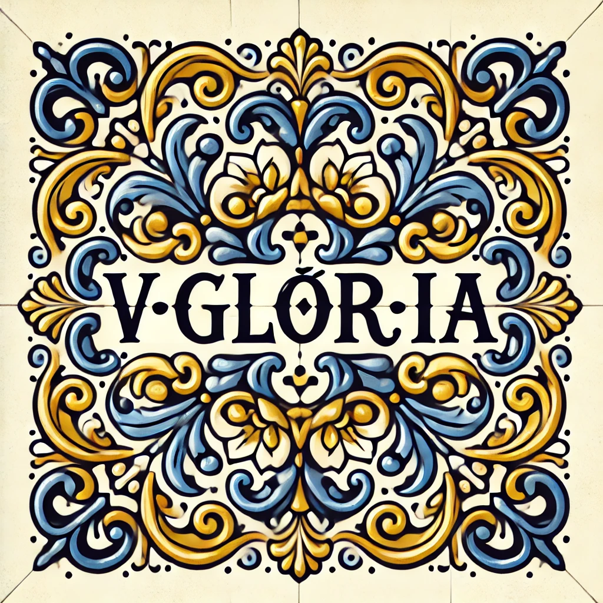

# V-GlórIA
<p align="center"></center></p> 

This is the code used to train our model V-GlórIA. We use the code from 
[FROMAGe](https://github.com/kohjingyu/fromage)
and adapted for European Portuguese using the LLM [GlórIA](https://github.com/novasearch/glorIA-code).


# Paper
You can check our [paper](https://aclanthology.org/2024.customnlp4u-1.24/).

# Pretrained Checkpoints 
V-GlórIA model weights are 
[here](https://drive.google.com/file/d/1CFDfaDTF_8kj2hFzCTEzKgRy_MB0ZNAC/view?usp=drive_link), 
they should be saved in ```/VGlorIA_model```.

# Datasets
We share the datasets we translated:
- [CC3M PT-BR](https://huggingface.co/datasets/NOVA-vision-language/CC3M_PT-BR) (translated with MADLAD-400)
- [MSCOCO PT-BR](https://huggingface.co/datasets/NOVA-vision-language/MSCOCO_PT-BR) (translated with MADLAD-400)
- [VisDial PT-BR](https://huggingface.co/datasets/NOVA-vision-language/VisualDialogue_PT-BR) (translated with MADLAD-400)

Our PT-PT translations with DeepL will be available soon.


# Citation
If you find this work useful, please consider citing:
``` 
@inproceedings{simplicio-etal-2024-v,
    title = "{V}-{G}l{\'o}r{IA} - Customizing Large Vision and Language Models to {E}uropean {P}ortuguese",
    author = "Simpl{\'\i}cio, Afonso  and
      Semedo, David  and
      Magalhaes, Joao",
    booktitle = "Proceedings of the 1st Workshop on Customizable NLP: Progress and Challenges in Customizing NLP for a Domain, Application, Group, or Individual (CustomNLP4U)",
    month = nov,
    year = "2024",
    address = "Miami, Florida, USA",
    publisher = "Association for Computational Linguistics",
    url = "https://aclanthology.org/2024.customnlp4u-1.24",
    pages = "317--326"
}
```